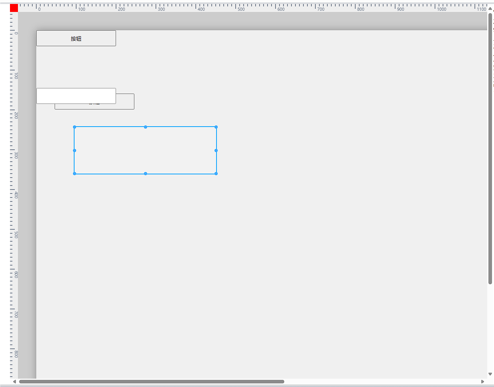
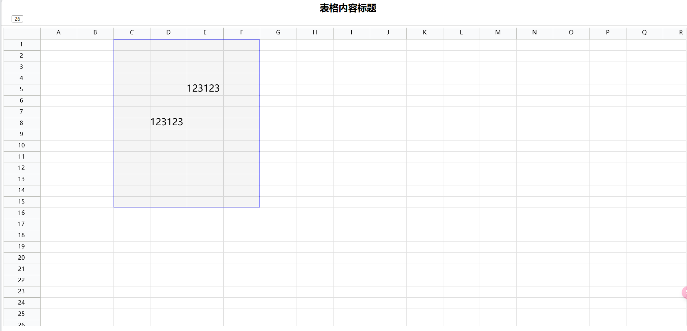

## 这是什么项目？
这是一个Demo **（如下图演示，该项目除核心部分，UI暂未开始进行优化）**，项目内容是面向低代码拖拽相关的内容，基于**Vue3 + Typescript、Canvas**，这个项目重点是中间板块的核心渲染部分。

*下图中，红色方形右边和下面的标尺，是用canvas绘制的，绘制区域的蓝色方块也是通过canvas绘制的。*

### 演示地址
[circle-dragger](https://circle-dragger.vercel.app/)

## Typescript + React + Canvas的项目
### [canvas表格（预览地址）](https://github.com/yuanxin518/table)
[仓库地址 : https://easydrag.netlify.app/](https://easydrag.netlify.app/)

这是一个代码量更大、开发周期更长的项目。使用canvas绘制的表格，能够进行表格框选、表格尺寸缩放等。

### [canvas拖拽交互（预览地址）](https://easydrag.netlify.app/)
